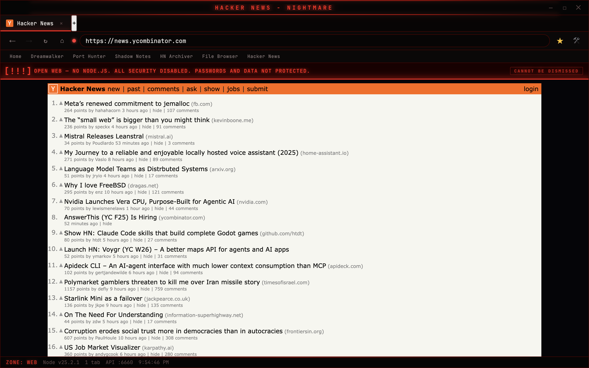
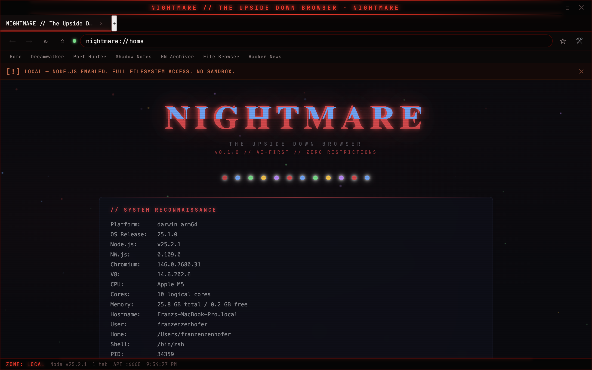
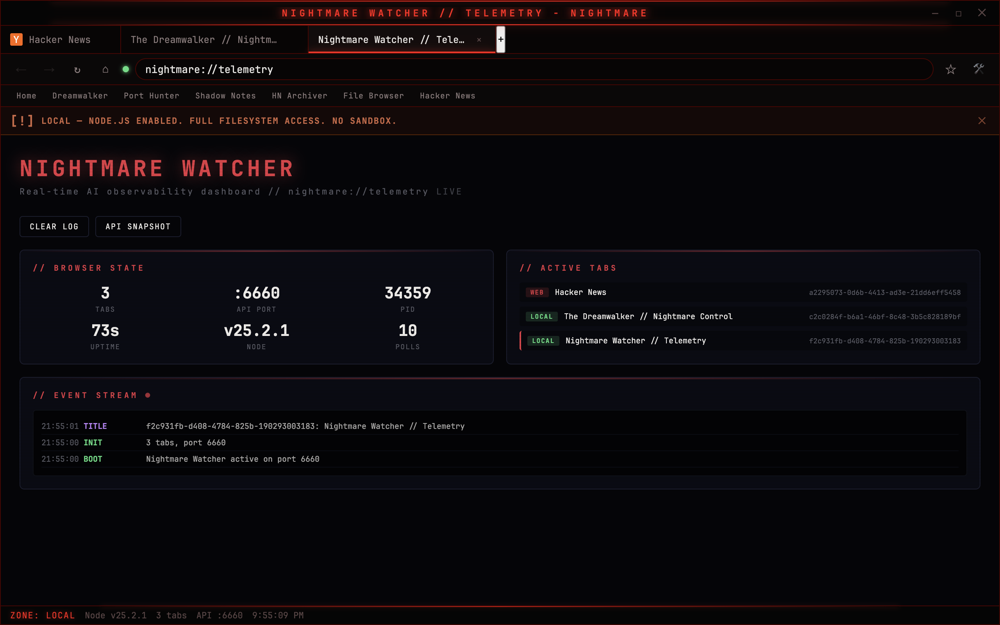
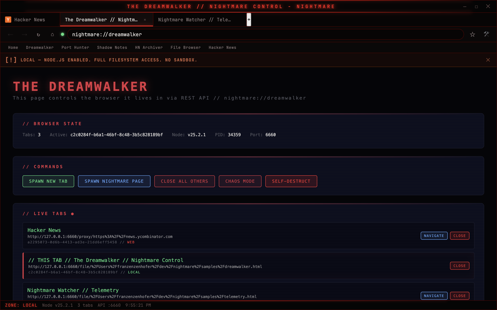

# Nightmare Browser



[](https://github.com/franzenzenhofer/nightmare/actions/workflows/ci.yml)

**Chrome without the safety rails.** An AI-first web browser with full Node.js in every tab, zero CORS, and a built-in REST API. Designed from the ground up to be controlled by AI agents.

---

## What Is This?

Every browser puts websites in a sandbox. Nightmare doesn't.

Every tab — local files, localhost servers, **and external websites** — gets full Node.js access. `require('fs')` works on google.com. `require('http')` works everywhere. There is no sandbox. There is no process isolation. The red security banner is a warning, not a restriction.

Nightmare ships with a **built-in REST API** on `localhost:6660`. Every browser action — creating tabs, navigating, executing JavaScript, reading console output, taking screenshots — is a `curl` command. Connect an AI agent, script your browser, or build your own dev tools on top of it.

It also includes a **built-in MCP server**, so AI agents like Claude Code can connect directly and control the browser through the Model Context Protocol.

**This is not a production browser.** This is a power tool for developers and AI agents who need unrestricted browser access.

---

## Quick Start

```bash
git clone https://github.com/franzenzenhofer/nightmare.git
cd nightmare
npm install
npm run dev
```

The API starts automatically on `http://localhost:6660`.

---

## See It In Action

### 1. Create a tab and navigate

```bash
curl -X POST http://localhost:6660/api/tabs \
  -H "Content-Type: application/json" \
  -d '{"url": "https://news.ycombinator.com"}'
```

```json
{
  "id": "a2295073-0d6b-4413-ad3e-21dd6eff5458",
  "displayUrl": "https://news.ycombinator.com",
  "title": "Hacker News",
  "zone": "WEB"
}
```

### 2. Execute JavaScript in that tab (with Node.js!)

```bash
curl -X POST http://localhost:6660/api/tabs/TAB_ID/execute \
  -H "Content-Type: application/json" \
  -d '{"code": "document.title + \" — Node \" + process.version"}'
```

```json
{
  "tabId": "a2295073-...",
  "result": "Hacker News — Node v25.2.1"
}
```

### 3. Read console output from any tab

```bash
curl http://localhost:6660/api/tabs/TAB_ID/console
```

### 4. Take a screenshot

```bash
curl http://localhost:6660/api/screenshot > browser.json
# Returns base64-encoded PNG of the full browser window
```

### 5. Get full browser state

```bash
curl http://localhost:6660/api/state
```

```json
{
  "tabs": [{"id": "...", "title": "Hacker News", "zone": "WEB"}, ...],
  "activeTabId": "a2295073-...",
  "tabCount": 3,
  "nodeVersion": "v25.2.1",
  "apiPort": 6660,
  "platform": "darwin"
}
```

---

## Why Not Puppeteer / Playwright / Selenium?

Those tools automate a browser **from the outside**. Nightmare gives you a browser where the inside has no limits.

| Feature | Puppeteer | Playwright | Nightmare |
|---------|-----------|------------|-----------|
| Node.js in every page | No | No | **Yes** |
| `require('fs')` on any website | No | No | **Yes** |
| Zero CORS | No | No | **Yes** |
| CSP headers stripped | No | No | **Yes** |
| GUI mode + headless | Headless-first | Headless-first | **Both natively** |
| Built-in REST API | No | No | **Yes (25+ endpoints)** |
| Built-in MCP server | No | No | **Yes** |
| Console log streaming | Limited | Limited | **Full ring buffer + WebSocket** |
| Load any site in iframe | No (CSP blocks) | No | **Yes** |
| Built-in bookmarks/history | No | No | **Yes** |
| Designed for AI agents | Adapted | Adapted | **Built for it** |

> **Note:** This is a different project from the now-deprecated [Segment/Nightmare](https://github.com/segmentio/nightmare) Electron automation library.

---

## Use Cases

**AI Agent Browser Automation** — Connect Claude Code or any AI via MCP or REST API. Navigate pages, click elements, type text, read console output, take screenshots — all programmatically. The browser is a first-class tool in your AI's toolkit.

**Web Scraping Without CORS** — Load any page. No CORS errors, no CSP blocks, no X-Frame-Options restrictions. Read the DOM. Save results with `require('fs').writeFileSync()`. Done.

**Full-Stack Debugging** — Run your web app in one tab. In the same tab, `require('fs')` to read server logs. Console output from every tab streams to the API in real time with `tabId`, `level`, and `timestamp`.

**Security Research** — Inject scripts into any page. Analyze cookies, localStorage, network requests. CSP headers are stripped. Every page is fully inspectable with full Node.js.

**Custom Browser Dev Tools** — Write an HTML file. It gets full Node.js access. It can read the filesystem, spawn child processes, make HTTP requests. Load it as a tab alongside your app. Build whatever tool you need.

**CI/CD Integration** — Run `npm run dev:headless` for headless mode. The REST API starts on launch. Script it with `curl` or any HTTP client. Take screenshots, validate pages, run integration tests.

**Teaching** — Show students what actually happens in a browser. No abstraction layers. `require('http').createServer()` works. The filesystem is accessible. The browser is transparent.

**Rapid Prototyping** — Build a full-stack app in a single HTML file. Frontend rendering + backend logic in one page. `fs`, `http`, `child_process`, `crypto` — all available in the browser tab.

---

## Screenshots

### Home Page



### Multi-Tab Browsing with Live Telemetry



### Dreamwalker — Built-in Control Panel



---

## Architecture

```
┌──────────────────────────────────────────────────┐
│  AI Agent / Claude Code / curl / MCP Client      │
│  (REST API  /  MCP Protocol  /  WebSocket)       │
├──────────────────────────────────────────────────┤
│  API Server  (localhost:6660)                    │
│  ┌──────────┐  ┌──────────┐  ┌───────────────┐  │
│  │   REST   │  │   MCP    │  │   WebSocket   │  │
│  │ Handlers │  │  Tools   │  │    Events     │  │
│  └────┬─────┘  └────┬─────┘  └──────┬────────┘  │
│       └──────────┬───┘───────────────┘           │
│           Route Registry                         │
│      (auto-sync REST ↔ MCP)                      │
├──────────────────────────────────────────────────┤
│  Services  (pure TypeScript, no DOM)             │
│  TabManager │ SecurityZones │ Navigation         │
│  History │ Bookmarks │ ConsoleCapture │ Storage  │
├──────────────────────────────────────────────────┤
│  NW.js Runtime                                   │
│  (Chromium + Node.js, zero sandbox)              │
└──────────────────────────────────────────────────┘
```

Every REST endpoint is **automatically exposed as an MCP tool** via the Route Registry. Add a new endpoint, get a new MCP tool — zero manual mapping.

---

## Three Security Zones

| Zone | URL Pattern | Node.js | Warning |
|------|-------------|---------|---------|
| **LOCAL** | `file://`, `nightmare://` | Full access | Informational |
| **LOCALHOST** | `localhost`, `127.0.0.1` | Full access | Informational |
| **WEB** | Everything else | Full access | Permanent red banner |

All zones have identical capabilities. The zones are **warnings, not restrictions**. The WEB zone banner cannot be dismissed — it's a permanent reminder that you're running untrusted code with full system access.

---

<details>
<summary><strong>Full API Reference (25+ endpoints)</strong></summary>

### Tab Management

| Method | Path | Description |
|--------|------|-------------|
| GET | `/api/tabs` | List all tabs |
| POST | `/api/tabs` | Create new tab |
| GET | `/api/tabs/:id` | Get tab details |
| DELETE | `/api/tabs/:id` | Close tab |
| POST | `/api/tabs/:id/activate` | Activate tab |
| POST | `/api/tabs/:id/duplicate` | Duplicate tab |
| POST | `/api/tabs/:id/pin` | Toggle pin |
| POST | `/api/tabs/:id/mute` | Toggle mute |

### Navigation

| Method | Path | Description |
|--------|------|-------------|
| POST | `/api/tabs/:id/navigate` | Navigate to URL |
| POST | `/api/tabs/:id/back` | Go back |
| POST | `/api/tabs/:id/forward` | Go forward |
| POST | `/api/tabs/:id/reload` | Reload page |

### Page Interaction

| Method | Path | Description |
|--------|------|-------------|
| POST | `/api/tabs/:id/execute` | Execute JavaScript |
| POST | `/api/tabs/:id/click` | Click element by selector |
| POST | `/api/tabs/:id/type` | Type into element |
| POST | `/api/tabs/:id/find` | Find text in page |
| POST | `/api/tabs/:id/wait-for` | Wait for selector |
| GET | `/api/tabs/:id/query` | Query DOM elements |

### Capture

| Method | Path | Description |
|--------|------|-------------|
| GET | `/api/screenshot` | Full window screenshot |
| GET | `/api/tabs/:id/screenshot` | Tab screenshot |
| GET | `/api/tabs/:id/html` | Get page HTML |
| GET | `/api/tabs/:id/console` | Get console logs |

### Browser Control

| Method | Path | Description |
|--------|------|-------------|
| GET | `/api/state` | Full browser state |
| POST | `/api/tabs/:id/zoom` | Set zoom level |
| POST | `/api/shutdown` | Shutdown browser |
| POST | `/api/relaunch` | Relaunch browser |

</details>

---

## MCP Integration

Connect Nightmare as an MCP server in your AI agent config:

```json
{
  "mcpServers": {
    "nightmare": {
      "url": "http://localhost:6660/mcp"
    }
  }
}
```

All REST endpoints are automatically available as MCP tools: `nightmare_create_tab`, `nightmare_navigate`, `nightmare_execute_js`, `nightmare_screenshot`, `nightmare_get_console`, and more.

---

## Headless Mode

```bash
npm run dev:headless
```

No window. API starts immediately. Same features, same endpoints. Use for CI/CD, automation, or AI agent workflows.

Outputs on startup:
```json
{"ready": true, "api": "http://localhost:6660"}
```

---

## Built-in Demo Apps

The `samples/` directory includes 7 demo applications that showcase Node.js integration:

| App | Description |
|-----|-------------|
| **Dreamwalker** | Browser control panel — manage tabs, trigger chaos mode |
| **Nightmare Watcher** | Real-time telemetry dashboard with event streaming |
| **Shadow Notes** | Note-taking app with filesystem persistence |
| **Zombie Port Hunter** | Network port scanner using Node.js `net` module |
| **File Browser** | Filesystem explorer using `fs` and `path` |
| **HN Shadow** | Hacker News archiver with local storage |
| **Home** | Landing page with system reconnaissance |

---

## Development

```bash
npm run dev          # Launch with DevTools
npm run dev:headless # Launch headless (API only)
npm run typecheck    # TypeScript strict check
npm run lint         # ESLint (zero warnings allowed)
npm run test         # 1,635 tests with 95%+ coverage
npm run check        # All quality gates at once
```

### Tech Stack

- **Runtime:** NW.js 0.109.0 (Chromium + Node.js)
- **Language:** TypeScript 5.x (strict mode, zero `any`)
- **Tests:** Vitest with V8 coverage (1,635 tests)
- **Linter:** ESLint + @typescript-eslint (strict + stylistic)
- **Build:** esbuild IIFE bundle
- **CI:** GitHub Actions

### Code Quality

1,635 unit tests. 98.6% statement coverage. TypeScript strict mode with zero `any` types. ESLint strict with zero warnings. Every public function has a test. Every REST endpoint has a corresponding MCP tool.

```
src/browser/
  services/     Pure business logic (49 files, 100% testable)
  components/   UI components (11 files)
  api/          REST + MCP server (14 files, auto-synced)
  runtime/      NW.js wiring layer
  __tests__/    Unit tests (75 files)
```

---

## Contributing

See [CONTRIBUTING.md](CONTRIBUTING.md) for setup, code style, and TDD workflow.

## Security

See [SECURITY.md](SECURITY.md). **TL;DR:** Nightmare deliberately disables web security. It is a developer tool, not a production browser.

## License

[MIT](LICENSE)
